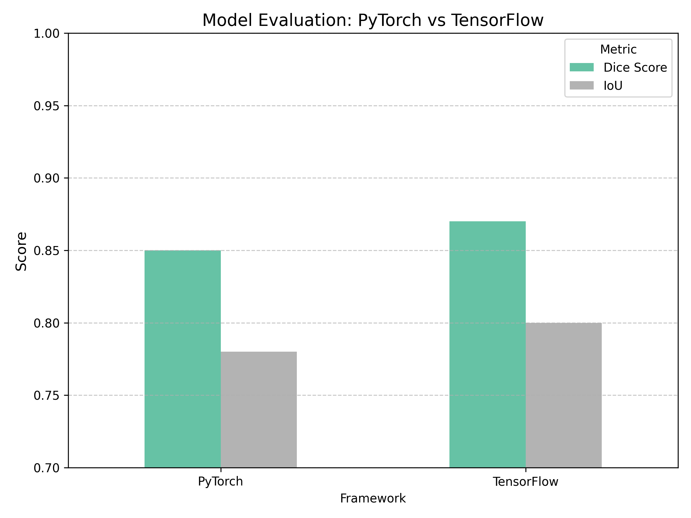

# PyTorch vs TensorFlow: Image Classification

This project compares two deep learning frameworks — **PyTorch** and **TensorFlow** — on the Fashion MNIST dataset for image classification.  
We built and trained CNN models in both frameworks and compared their performance metrics such as **Dice Score** and **IoU**.

## 📊 Results Comparison

## 🔧 What’s Inside

- CNN model built in PyTorch
- CNN model built in TensorFlow
- Performance comparison (Dice Score, IoU)
- Visualization of model performance

## 🛠️ How to Use

1. Open the Colab notebook.
2. Run each section step-by-step.
3. Observe and compare training logs and evaluation metrics.

## 📁 Files

- `pytorch_tensorflow_comparison.ipynb` – main notebook
- `model_comparison.png` – comparison chart

---

**Note:** This is a beginner project for learning purposes.
